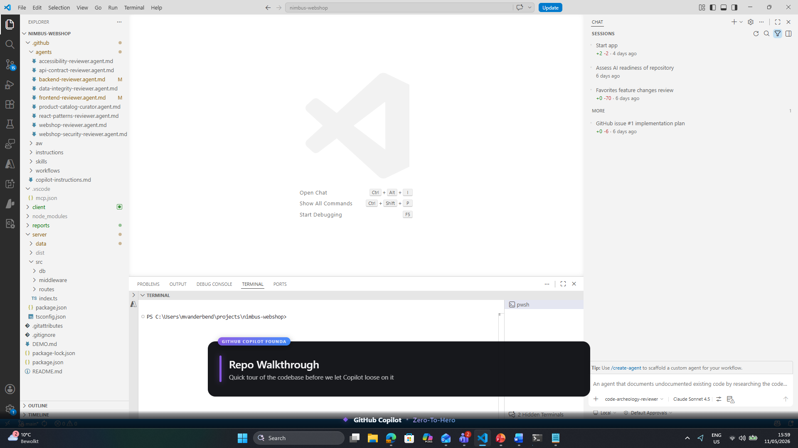
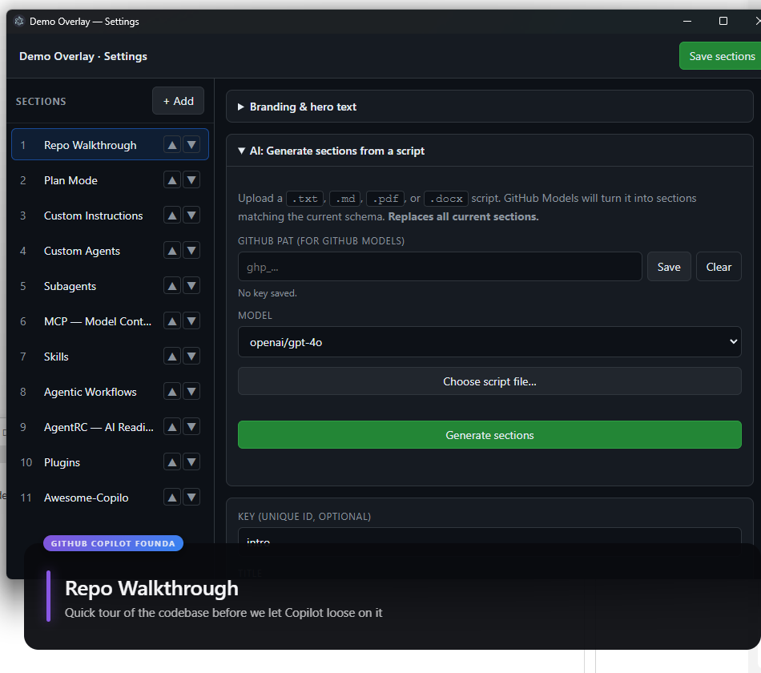
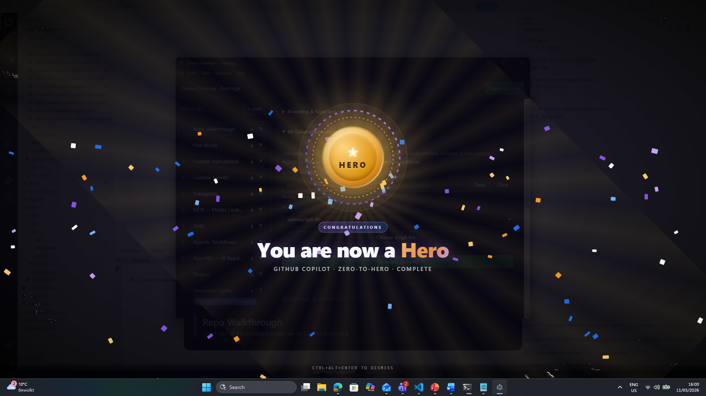

# Demo Overlay

[](LICENSE)
[](https://www.electronjs.org/)
[](https://github.com/mvanderbend-msoft/demo-overlay-app/releases)
[](CONTRIBUTING.md)

A transparent, always-on-top **lower-third banner** for VS Code GitHub Copilot
demos. Shows the current topic (title + subtitle + position indicator) over
whatever app you're presenting, controlled by global keyboard shortcuts.

Built with Electron — designed to be visible when sharing your screen in
Microsoft Teams.



## Quick start

**Pre-built installer (Windows):** grab the latest `.exe` from
[Releases](https://github.com/mvanderbend-msoft/demo-overlay-app/releases).

**From source:**

```sh
git clone https://github.com/mvanderbend-msoft/demo-overlay-app.git
cd demo-overlay-app
npm install
npm start
```

The overlay opens centered at the bottom of your primary display and is
**click-through** (it never steals focus from VS Code). On first run, your
local `sections.json` is seeded from [`sections.example.json`](sections.example.json)
— edit it (or use the Settings UI) and the overlay hot-reloads.

> `sections.json` is **gitignored** so your personal demo script never gets
> committed. Only the example file ships with the repo.

## Default hotkeys

| Shortcut             | Action                                |
| -------------------- | ------------------------------------- |
| `Ctrl+Alt+→`         | Next section                          |
| `Ctrl+Alt+←`         | Previous section                      |
| `Ctrl+Alt+Home`      | Jump to first section                 |
| `Ctrl+Alt+1` … `9`   | Jump to section 1..9                  |
| `Ctrl+Alt+0`         | Jump to section 10                    |
| `Ctrl+Alt+Space`     | Toggle expanded details view          |
| `Ctrl+Alt+H`         | Toggle overlay visibility             |
| `Ctrl+Alt+F`         | Toggle positioning frame guide        |
| `Ctrl+Alt+Enter`     | Toggle hero finale screen             |
| `Ctrl+Alt+,`         | Open Settings window                  |
| `Ctrl+Alt+Q`         | Quit                                  |

Override these in `config.json`.

## Settings UI & AI section generation

A **tray icon** (purple square) appears in your system tray when the overlay
runs. Click it — or press `Ctrl+Alt+,` — to open the Settings window. From
there you can:

- **Manage sections**: add, remove, reorder, and edit titles, subtitles,
  details, notes, and animation keys. Save to write `sections.json`; the
  overlay hot-reloads.
- **Customize branding & hero text**: change the small label above each
  section (default: *GitHub Copilot Foundations*) and the celebration screen
  shown after the last section — eyebrow (*CONGRATULATIONS*), big title
  (*You are now a Hero*), and subtitle. The last word of the hero title is
  automatically wrapped in the gradient highlight.
- **Generate sections from a script**: paste a GitHub PAT (stored encrypted
  via Electron `safeStorage` in your user-data folder), upload a `.txt`,
  `.md`, `.pdf`, or `.docx` script, and let GitHub Models turn it into
  sections matching the schema. Review, tweak, then **Save**.



The PAT needs access to **GitHub Models** (`models:read`).

## Hero finale

When you advance past the last section, a full-screen celebration takes over
the primary display — gold medal, animated rays, confetti, and your custom
hero text. Press `Ctrl+Alt+Enter` to toggle it on demand, or to dismiss.



## Authoring the script — `sections.json`

```json
[
  { "title": "Custom Instructions", "subtitle": "Steer Copilot's behavior with .github/copilot-instructions.md" },
  { "title": "Skills",              "subtitle": "Composable capabilities your agent can invoke" }
]
```

Save the file — the overlay reloads automatically. The repo ships with
[`sections.example.json`](sections.example.json) containing two placeholder
sections (*Welcome*, *Next Steps*) so you have a working starting point; replace
them with your own demo script, or generate one from a document via the
Settings UI.

## Configuration — `config.json`

```json
{
  "position": "bottom-center",   // bottom-center | bottom-left | bottom-right | top-center
  "width": 960,
  "collapsedHeight": 160,        // overlay height when only title + subtitle are shown
  "expandedHeight": 460,         // overlay height when details are expanded (Ctrl+Alt+Space)
  "marginBottom": 60,
  "accentColor": "#8957e5",
  "brandTitle": "GitHub Copilot Foundations",
  "heroEyebrow": "CONGRATULATIONS",
  "heroTitle": "You are now a Hero",
  "heroSubtitle": "GitHub Copilot · Zero-To-Hero · Complete",
  "hotkeys": { "next": "Control+Alt+Right", "...": "..." }
}
```

## Where is data stored?

| What | Where | Notes |
| ---- | ----- | ----- |
| **Sections** (`sections.json`) | Repo root, next to `main.js` | Plain JSON. Hot-reloaded on save. Edit by hand, or via the Settings UI. |
| **Config** (`config.json`) | Repo root | Position, hotkeys, accent color. |
| **GitHub PAT** (for AI generation) | `%APPDATA%\demo-overlay\github-models.key` on Windows<br>(macOS: `~/Library/Application Support/demo-overlay/`,<br> Linux: `~/.config/demo-overlay/`) | Encrypted with Electron `safeStorage` (DPAPI on Windows, Keychain on macOS, libsecret on Linux). **Never** written to the repo. Clear it any time from the Settings window. |
| **Uploaded scripts** (`.txt`/`.pdf`/`.docx`) | Not persisted | Read once from the path you pick, sent to GitHub Models, then forgotten. Only the generated sections are saved (and only when you click **Save**). |

To find your user-data folder quickly: open Settings → tray icon menu → or run
`echo %APPDATA%\demo-overlay` in a terminal.

## ⚠️ Sharing in Microsoft Teams

Transparent always-on-top windows are **only captured when you share the entire
desktop / screen** — not when you share a single window. In Teams, choose:

> Share → **Screen** (not "Window")

If you share VS Code as a single window, the overlay will not appear in the
captured stream. This is a limitation of how Windows window-capture APIs treat
layered/transparent windows, not of this app.

## Troubleshooting

- **Overlay doesn't appear:** another fullscreen app may be on top. Toggle it
  with `Ctrl+Alt+H`, or restart.
- **Hotkeys don't work:** another app may have already registered the same
  global shortcut. Override in `config.json`.
- **It's blocking my clicks:** it shouldn't — the window is click-through. If
  it does, you've found a bug; please report it.

## Contributing

Bug reports, ideas, and pull requests are welcome — see
[`CONTRIBUTING.md`](CONTRIBUTING.md) for the short version. The repo ships
with bug / feature issue templates to make filing easy.

## License

MIT — see [`LICENSE`](LICENSE).

## Project layout

```
demo-overlay-app/
├── main.js                  # Electron main: windows, shortcuts, hot-reload, tray, IPC
├── preload.js               # IPC bridge to overlay renderer
├── settings/
│   ├── index.html           # Settings UI
│   ├── settings.css
│   ├── settings.js
│   ├── preload.js           # IPC bridge for settings window
│   └── generate.js          # Script parsing + GitHub Models call
├── renderer/
│   ├── index.html           # Lower-third overlay
│   ├── styles.css
│   ├── renderer.js
│   ├── animations.js        # Per-section title/subtitle animations
│   ├── frame.html / .css    # Positioning frame guide (Ctrl+Alt+F)
│   └── hero.html / .css / .js  # Full-screen hero finale
├── docs/screenshots/        # README images
├── sections.example.json    # Seed for sections.json on first run
├── sections.json            # Your demo script (gitignored — edit or generate)
├── config.json              # Position, sizes, hotkeys, branding, hero text
└── package.json
```
